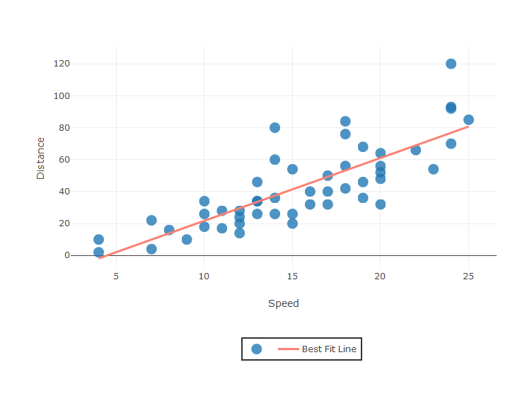
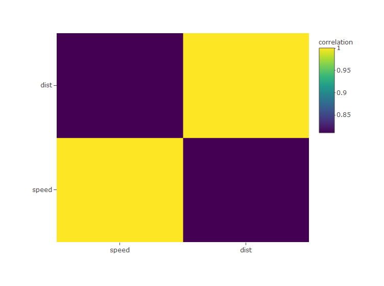
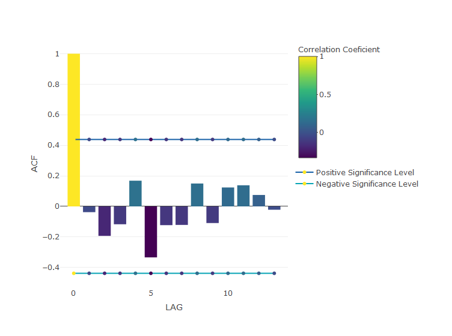
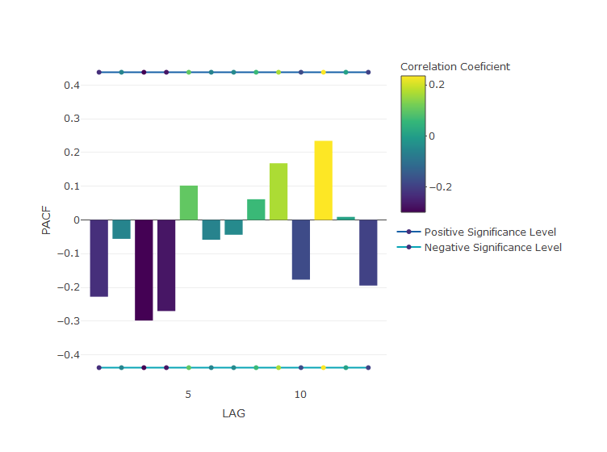
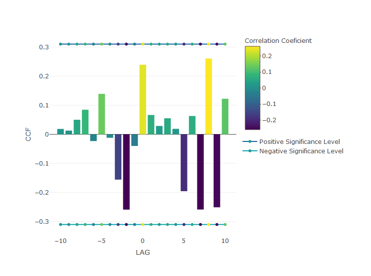

<!-- README.md is generated from README.Rmd. Please edit that file -->

# Corrly <a href='https://maheshkulkarnix.github.io/corrly/'></a>

### Corrly is a Data Visualization Package For All Types of Correlation Charts using Plotly Package.

## Install Corrly

install.packages("devtools")

devtools::install_github("maheshKulkarniX/corrlY")

## Getting started

``` r
library(plotly)

# For Example Consider Dataframe "cars" which is already predefined dataset in R.
head(cars)
#>   speed dist
#> 1     4    2
#> 2     4   10
#> 3     7    4
#> 4     7   22
#> 5     8   16
#> 6     9   10
```

## correlation Coeficient using pearson Method

Method:- corr\_coef\_pearson(variable1 = variable1, variable2 =
variable2, decimal = 2)

``` r
# Example: 
corr_coef_pearson(variable1 = cars$speed, variable2 = cars$dist, decimal = 2)
#> [1] 0.81
```

## correlation Coeficient using kendall Method

Method:- corr\_coef\_kendall(variable1 = variable1, variable2 =
variable2, decimal = 2)

``` r
# Example: 
corr_coef_kendall(variable1 = cars$speed, variable2 = cars$dist, decimal = 2)
#> [1] 0.67
```

## correlation Coeficient using spearman Method

Method:- corr\_coef\_spearman(variable1 = variable1, variable2 =
variable2, decimal = 2)

``` r
# Example: 
corr_coef_spearman(variable1 = cars$speed, variable2 = cars$dist, decimal = 2)
#> [1] 0.83
```

## Correlation Scatter Plot

Method:- corr\_scatterly(data= data\_frame, variable1=
data\_frame\(col1, variable2=data_frame\)col2, corr\_coef= spearman,
xname=“Name on X-axis”, yname=“Name on Y-axis”)

``` r
# Example: 
spearman<- corr_coef_spearman(variable1 = cars$speed, variable2 = cars$dist, decimal = 2)
corr_scatterly(data= cars, variable1= cars$speed, variable2= cars$dist, corr_coef= spearman, xname="Speed", yname="Distance")
#> Warning in plotly::config(., displaylogo = FALSE, collaborate = FALSE): The
#> collaborate button is no longer supported
#> Warning: 'config' objects don't have these attributes: 'collaborate'
#> Valid attributes include:
#> 'staticPlot', 'plotlyServerURL', 'editable', 'edits', 'autosizable', 'responsive', 'fillFrame', 'frameMargins', 'scrollZoom', 'doubleClick', 'showAxisDragHandles', 'showAxisRangeEntryBoxes', 'showTips', 'showLink', 'linkText', 'sendData', 'showSources', 'displayModeBar', 'showSendToCloud', 'modeBarButtonsToRemove', 'modeBarButtonsToAdd', 'modeBarButtons', 'toImageButtonOptions', 'displaylogo', 'watermark', 'plotGlPixelRatio', 'setBackground', 'topojsonURL', 'mapboxAccessToken', 'logging', 'queueLength', 'globalTransforms', 'locale', 'locales'
```

<!-- -->

## Correlation Matrix Plot

Method:- matrixly(data = data\_frame)

``` r
# Example: 
matrixly(data = cars)
#> Warning in plotly::config(., displaylogo = FALSE, collaborate = FALSE): The
#> collaborate button is no longer supported
#> Warning: 'config' objects don't have these attributes: 'collaborate'
#> Valid attributes include:
#> 'staticPlot', 'plotlyServerURL', 'editable', 'edits', 'autosizable', 'responsive', 'fillFrame', 'frameMargins', 'scrollZoom', 'doubleClick', 'showAxisDragHandles', 'showAxisRangeEntryBoxes', 'showTips', 'showLink', 'linkText', 'sendData', 'showSources', 'displayModeBar', 'showSendToCloud', 'modeBarButtonsToRemove', 'modeBarButtonsToAdd', 'modeBarButtons', 'toImageButtonOptions', 'displaylogo', 'watermark', 'plotGlPixelRatio', 'setBackground', 'topojsonURL', 'mapboxAccessToken', 'logging', 'queueLength', 'globalTransforms', 'locale', 'locales'
#> Warning: 'heatmap' objects don't have these attributes: 'marker'
#> Valid attributes include:
#> 'type', 'visible', 'showlegend', 'legendgroup', 'opacity', 'name', 'uid', 'ids', 'customdata', 'selectedpoints', 'hoverinfo', 'hoverlabel', 'stream', 'transforms', 'uirevision', 'z', 'x', 'x0', 'dx', 'y', 'y0', 'dy', 'text', 'hovertext', 'transpose', 'xtype', 'ytype', 'zsmooth', 'connectgaps', 'xgap', 'ygap', 'zhoverformat', 'hovertemplate', 'zauto', 'zmin', 'zmax', 'zmid', 'colorscale', 'autocolorscale', 'reversescale', 'showscale', 'colorbar', 'xcalendar', 'ycalendar', 'xaxis', 'yaxis', 'idssrc', 'customdatasrc', 'hoverinfosrc', 'zsrc', 'xsrc', 'ysrc', 'textsrc', 'hovertextsrc', 'hovertemplatesrc', 'key', 'set', 'frame', 'transforms', '_isNestedKey', '_isSimpleKey', '_isGraticule', '_bbox'
```

<!-- -->

## Autocorrelation

Method:- acf\_ly(Series)

``` r
#Example:- 
temp_10to11_AM<- c(21, 20, 11, 10, 9.1, 11.6, 12, 15.10, 18, 19)
temp_12to1_PM<- c(14, 22, 13, 17, 7.1, 21.6, 15, 5.20, 8, 29)
temp_1to2_PM<- c(31, 10, 1, 0.7, 1.1, 31.6, 2, 17.10, 8, 9)
temp_3to4_PM<- c(4, 12, 3, 7, 8.1, 2.6, 17, 5.20, 8, 9)
tempreature<- data.frame(temp_10to11_AM, temp_12to1_PM, temp_1to2_PM, temp_3to4_PM)
head(tempreature)
#>   temp_10to11_AM temp_12to1_PM temp_1to2_PM temp_3to4_PM
#> 1           21.0          14.0         31.0          4.0
#> 2           20.0          22.0         10.0         12.0
#> 3           11.0          13.0          1.0          3.0
#> 4           10.0          17.0          0.7          7.0
#> 5            9.1           7.1          1.1          8.1
#> 6           11.6          21.6         31.6          2.6
a_series<- c(tempreature$temp_10to11_AM, tempreature$temp_12to1_PM)
acf_ly(series = a_series)
#> Warning in config(., displaylogo = FALSE, collaborate = FALSE): The
#> collaborate button is no longer supported
#> Warning: textfont.color doesn't (yet) support data arrays
#> Warning: line.color doesn't (yet) support data arrays

#> Warning: line.color doesn't (yet) support data arrays
#> Warning: textfont.color doesn't (yet) support data arrays
#> Warning: line.color doesn't (yet) support data arrays

#> Warning: line.color doesn't (yet) support data arrays
#> Warning: 'config' objects don't have these attributes: 'collaborate'
#> Valid attributes include:
#> 'staticPlot', 'plotlyServerURL', 'editable', 'edits', 'autosizable', 'responsive', 'fillFrame', 'frameMargins', 'scrollZoom', 'doubleClick', 'showAxisDragHandles', 'showAxisRangeEntryBoxes', 'showTips', 'showLink', 'linkText', 'sendData', 'showSources', 'displayModeBar', 'showSendToCloud', 'modeBarButtonsToRemove', 'modeBarButtonsToAdd', 'modeBarButtons', 'toImageButtonOptions', 'displaylogo', 'watermark', 'plotGlPixelRatio', 'setBackground', 'topojsonURL', 'mapboxAccessToken', 'logging', 'queueLength', 'globalTransforms', 'locale', 'locales'
#> Warning: 'bar' objects don't have these attributes: 'mode'
#> Valid attributes include:
#> 'type', 'visible', 'showlegend', 'legendgroup', 'opacity', 'name', 'uid', 'ids', 'customdata', 'selectedpoints', 'hoverinfo', 'hoverlabel', 'stream', 'transforms', 'uirevision', 'x', 'x0', 'dx', 'y', 'y0', 'dy', 'text', 'hovertext', 'hovertemplate', 'textposition', 'textfont', 'insidetextfont', 'outsidetextfont', 'constraintext', 'cliponaxis', 'orientation', 'base', 'offset', 'width', 'marker', 'offsetgroup', 'alignmentgroup', 'selected', 'unselected', 'r', 't', '_deprecated', 'error_x', 'error_y', 'xcalendar', 'ycalendar', 'xaxis', 'yaxis', 'idssrc', 'customdatasrc', 'hoverinfosrc', 'xsrc', 'ysrc', 'textsrc', 'hovertextsrc', 'hovertemplatesrc', 'textpositionsrc', 'basesrc', 'offsetsrc', 'widthsrc', 'rsrc', 'tsrc', 'key', 'set', 'frame', 'transforms', '_isNestedKey', '_isSimpleKey', '_isGraticule', '_bbox'
#> Warning: 'config' objects don't have these attributes: 'collaborate'
#> Valid attributes include:
#> 'staticPlot', 'plotlyServerURL', 'editable', 'edits', 'autosizable', 'responsive', 'fillFrame', 'frameMargins', 'scrollZoom', 'doubleClick', 'showAxisDragHandles', 'showAxisRangeEntryBoxes', 'showTips', 'showLink', 'linkText', 'sendData', 'showSources', 'displayModeBar', 'showSendToCloud', 'modeBarButtonsToRemove', 'modeBarButtonsToAdd', 'modeBarButtons', 'toImageButtonOptions', 'displaylogo', 'watermark', 'plotGlPixelRatio', 'setBackground', 'topojsonURL', 'mapboxAccessToken', 'logging', 'queueLength', 'globalTransforms', 'locale', 'locales'
#> Warning: 'bar' objects don't have these attributes: 'mode'
#> Valid attributes include:
#> 'type', 'visible', 'showlegend', 'legendgroup', 'opacity', 'name', 'uid', 'ids', 'customdata', 'selectedpoints', 'hoverinfo', 'hoverlabel', 'stream', 'transforms', 'uirevision', 'x', 'x0', 'dx', 'y', 'y0', 'dy', 'text', 'hovertext', 'hovertemplate', 'textposition', 'textfont', 'insidetextfont', 'outsidetextfont', 'constraintext', 'cliponaxis', 'orientation', 'base', 'offset', 'width', 'marker', 'offsetgroup', 'alignmentgroup', 'selected', 'unselected', 'r', 't', '_deprecated', 'error_x', 'error_y', 'xcalendar', 'ycalendar', 'xaxis', 'yaxis', 'idssrc', 'customdatasrc', 'hoverinfosrc', 'xsrc', 'ysrc', 'textsrc', 'hovertextsrc', 'hovertemplatesrc', 'textpositionsrc', 'basesrc', 'offsetsrc', 'widthsrc', 'rsrc', 'tsrc', 'key', 'set', 'frame', 'transforms', '_isNestedKey', '_isSimpleKey', '_isGraticule', '_bbox'
```

<!-- -->

## Partial Autocorrelation

Method:- pacf\_ly(series)

``` r
p_series<- c(tempreature$temp_1to2_PM, tempreature$temp_3to4_PM)
pacf_ly(series = p_series)
#> Warning in config(., displaylogo = FALSE, collaborate = FALSE): The
#> collaborate button is no longer supported
#> Warning: textfont.color doesn't (yet) support data arrays
#> Warning: line.color doesn't (yet) support data arrays

#> Warning: line.color doesn't (yet) support data arrays
#> Warning: textfont.color doesn't (yet) support data arrays
#> Warning: line.color doesn't (yet) support data arrays

#> Warning: line.color doesn't (yet) support data arrays
#> Warning: 'config' objects don't have these attributes: 'collaborate'
#> Valid attributes include:
#> 'staticPlot', 'plotlyServerURL', 'editable', 'edits', 'autosizable', 'responsive', 'fillFrame', 'frameMargins', 'scrollZoom', 'doubleClick', 'showAxisDragHandles', 'showAxisRangeEntryBoxes', 'showTips', 'showLink', 'linkText', 'sendData', 'showSources', 'displayModeBar', 'showSendToCloud', 'modeBarButtonsToRemove', 'modeBarButtonsToAdd', 'modeBarButtons', 'toImageButtonOptions', 'displaylogo', 'watermark', 'plotGlPixelRatio', 'setBackground', 'topojsonURL', 'mapboxAccessToken', 'logging', 'queueLength', 'globalTransforms', 'locale', 'locales'
#> Warning: 'bar' objects don't have these attributes: 'mode'
#> Valid attributes include:
#> 'type', 'visible', 'showlegend', 'legendgroup', 'opacity', 'name', 'uid', 'ids', 'customdata', 'selectedpoints', 'hoverinfo', 'hoverlabel', 'stream', 'transforms', 'uirevision', 'x', 'x0', 'dx', 'y', 'y0', 'dy', 'text', 'hovertext', 'hovertemplate', 'textposition', 'textfont', 'insidetextfont', 'outsidetextfont', 'constraintext', 'cliponaxis', 'orientation', 'base', 'offset', 'width', 'marker', 'offsetgroup', 'alignmentgroup', 'selected', 'unselected', 'r', 't', '_deprecated', 'error_x', 'error_y', 'xcalendar', 'ycalendar', 'xaxis', 'yaxis', 'idssrc', 'customdatasrc', 'hoverinfosrc', 'xsrc', 'ysrc', 'textsrc', 'hovertextsrc', 'hovertemplatesrc', 'textpositionsrc', 'basesrc', 'offsetsrc', 'widthsrc', 'rsrc', 'tsrc', 'key', 'set', 'frame', 'transforms', '_isNestedKey', '_isSimpleKey', '_isGraticule', '_bbox'
#> Warning: 'config' objects don't have these attributes: 'collaborate'
#> Valid attributes include:
#> 'staticPlot', 'plotlyServerURL', 'editable', 'edits', 'autosizable', 'responsive', 'fillFrame', 'frameMargins', 'scrollZoom', 'doubleClick', 'showAxisDragHandles', 'showAxisRangeEntryBoxes', 'showTips', 'showLink', 'linkText', 'sendData', 'showSources', 'displayModeBar', 'showSendToCloud', 'modeBarButtonsToRemove', 'modeBarButtonsToAdd', 'modeBarButtons', 'toImageButtonOptions', 'displaylogo', 'watermark', 'plotGlPixelRatio', 'setBackground', 'topojsonURL', 'mapboxAccessToken', 'logging', 'queueLength', 'globalTransforms', 'locale', 'locales'
#> Warning: 'bar' objects don't have these attributes: 'mode'
#> Valid attributes include:
#> 'type', 'visible', 'showlegend', 'legendgroup', 'opacity', 'name', 'uid', 'ids', 'customdata', 'selectedpoints', 'hoverinfo', 'hoverlabel', 'stream', 'transforms', 'uirevision', 'x', 'x0', 'dx', 'y', 'y0', 'dy', 'text', 'hovertext', 'hovertemplate', 'textposition', 'textfont', 'insidetextfont', 'outsidetextfont', 'constraintext', 'cliponaxis', 'orientation', 'base', 'offset', 'width', 'marker', 'offsetgroup', 'alignmentgroup', 'selected', 'unselected', 'r', 't', '_deprecated', 'error_x', 'error_y', 'xcalendar', 'ycalendar', 'xaxis', 'yaxis', 'idssrc', 'customdatasrc', 'hoverinfosrc', 'xsrc', 'ysrc', 'textsrc', 'hovertextsrc', 'hovertemplatesrc', 'textpositionsrc', 'basesrc', 'offsetsrc', 'widthsrc', 'rsrc', 'tsrc', 'key', 'set', 'frame', 'transforms', '_isNestedKey', '_isSimpleKey', '_isGraticule', '_bbox'
```

<!-- -->

## Cross Correlation

Method:- ccf\_ly(series1, series2)

``` r
ccf_ly(a_series, p_series)
#> Warning in config(., displaylogo = FALSE, collaborate = FALSE): The
#> collaborate button is no longer supported
#> Warning: textfont.color doesn't (yet) support data arrays
#> Warning: line.color doesn't (yet) support data arrays

#> Warning: line.color doesn't (yet) support data arrays
#> Warning: textfont.color doesn't (yet) support data arrays
#> Warning: line.color doesn't (yet) support data arrays

#> Warning: line.color doesn't (yet) support data arrays
#> Warning: 'config' objects don't have these attributes: 'collaborate'
#> Valid attributes include:
#> 'staticPlot', 'plotlyServerURL', 'editable', 'edits', 'autosizable', 'responsive', 'fillFrame', 'frameMargins', 'scrollZoom', 'doubleClick', 'showAxisDragHandles', 'showAxisRangeEntryBoxes', 'showTips', 'showLink', 'linkText', 'sendData', 'showSources', 'displayModeBar', 'showSendToCloud', 'modeBarButtonsToRemove', 'modeBarButtonsToAdd', 'modeBarButtons', 'toImageButtonOptions', 'displaylogo', 'watermark', 'plotGlPixelRatio', 'setBackground', 'topojsonURL', 'mapboxAccessToken', 'logging', 'queueLength', 'globalTransforms', 'locale', 'locales'
#> Warning: 'bar' objects don't have these attributes: 'mode'
#> Valid attributes include:
#> 'type', 'visible', 'showlegend', 'legendgroup', 'opacity', 'name', 'uid', 'ids', 'customdata', 'selectedpoints', 'hoverinfo', 'hoverlabel', 'stream', 'transforms', 'uirevision', 'x', 'x0', 'dx', 'y', 'y0', 'dy', 'text', 'hovertext', 'hovertemplate', 'textposition', 'textfont', 'insidetextfont', 'outsidetextfont', 'constraintext', 'cliponaxis', 'orientation', 'base', 'offset', 'width', 'marker', 'offsetgroup', 'alignmentgroup', 'selected', 'unselected', 'r', 't', '_deprecated', 'error_x', 'error_y', 'xcalendar', 'ycalendar', 'xaxis', 'yaxis', 'idssrc', 'customdatasrc', 'hoverinfosrc', 'xsrc', 'ysrc', 'textsrc', 'hovertextsrc', 'hovertemplatesrc', 'textpositionsrc', 'basesrc', 'offsetsrc', 'widthsrc', 'rsrc', 'tsrc', 'key', 'set', 'frame', 'transforms', '_isNestedKey', '_isSimpleKey', '_isGraticule', '_bbox'
#> Warning: 'config' objects don't have these attributes: 'collaborate'
#> Valid attributes include:
#> 'staticPlot', 'plotlyServerURL', 'editable', 'edits', 'autosizable', 'responsive', 'fillFrame', 'frameMargins', 'scrollZoom', 'doubleClick', 'showAxisDragHandles', 'showAxisRangeEntryBoxes', 'showTips', 'showLink', 'linkText', 'sendData', 'showSources', 'displayModeBar', 'showSendToCloud', 'modeBarButtonsToRemove', 'modeBarButtonsToAdd', 'modeBarButtons', 'toImageButtonOptions', 'displaylogo', 'watermark', 'plotGlPixelRatio', 'setBackground', 'topojsonURL', 'mapboxAccessToken', 'logging', 'queueLength', 'globalTransforms', 'locale', 'locales'
#> Warning: 'bar' objects don't have these attributes: 'mode'
#> Valid attributes include:
#> 'type', 'visible', 'showlegend', 'legendgroup', 'opacity', 'name', 'uid', 'ids', 'customdata', 'selectedpoints', 'hoverinfo', 'hoverlabel', 'stream', 'transforms', 'uirevision', 'x', 'x0', 'dx', 'y', 'y0', 'dy', 'text', 'hovertext', 'hovertemplate', 'textposition', 'textfont', 'insidetextfont', 'outsidetextfont', 'constraintext', 'cliponaxis', 'orientation', 'base', 'offset', 'width', 'marker', 'offsetgroup', 'alignmentgroup', 'selected', 'unselected', 'r', 't', '_deprecated', 'error_x', 'error_y', 'xcalendar', 'ycalendar', 'xaxis', 'yaxis', 'idssrc', 'customdatasrc', 'hoverinfosrc', 'xsrc', 'ysrc', 'textsrc', 'hovertextsrc', 'hovertemplatesrc', 'textpositionsrc', 'basesrc', 'offsetsrc', 'widthsrc', 'rsrc', 'tsrc', 'key', 'set', 'frame', 'transforms', '_isNestedKey', '_isSimpleKey', '_isGraticule', '_bbox'
```

<!-- -->
